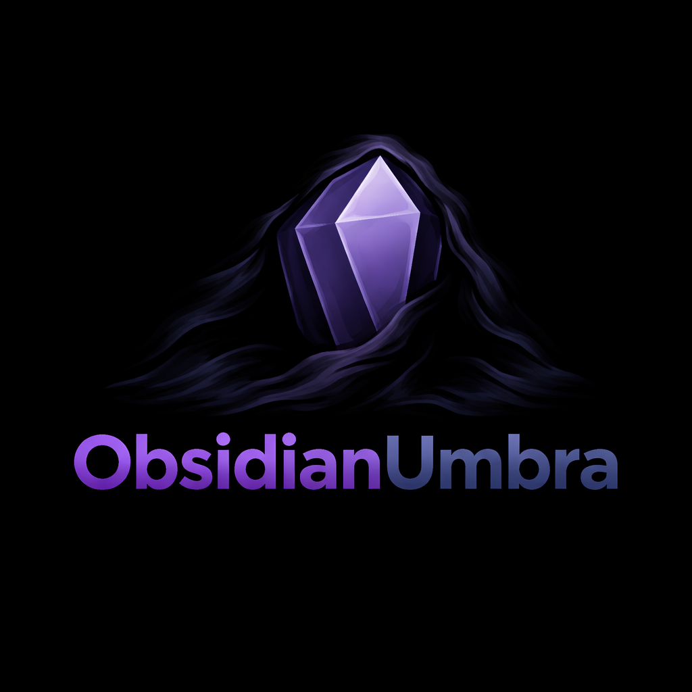

<p align="center">
  
</p>

<p align="center">
  <strong>Turn any Obsidian vault into a Zettelkasten graph — locally, with a dozen years of notes in minutes.</strong>
</p>

<p align="center">
  <a href="#quick-start">Quick Start</a> •
  <a href="#how-it-works">How It Works</a> •
  <a href="#before--after">Before / After</a> •
  <a href="docs/phases.md">Phases</a> •
  <a href="docs/troubleshooting.md">Troubleshooting</a>
</p>

<p align="center">
  
  
  
  
  <a href="https://paypal.me/jimnoneill"></a>
</p>

---

## Why?

Obsidian's graph view is only as good as the `[[wikilinks]]` you remember to write. Years of daily notes pile up with zero connections. LLM "second brain" tools exist — but they send every note to a cloud API.

Umbra runs entirely on your own machine. It splits daily journal entries into titled topic notes, then weaves four layers of backlinks across your whole vault so the graph actually lights up.

```
┌─────────────────────────┐                    ┌─────────────────────────┐
│     OBSIDIAN VAULT      │                    │        LOCAL GPU        │
│                         │    file I/O only   │                         │
│   Daily notes           │◄──────────────────►│   Qwen3-4B-Instruct     │
│   Project notes         │                    │   Potion-32M            │
│   Folder structure      │                    │   GTE-large + HDBSCAN   │
│                         │                    │                         │
│   [[wikilinks]] graph   │   nothing leaves   │   4-phase pipeline      │
└─────────────────────────┘   your machine     └─────────────────────────┘
```

## Quick Start

### Prerequisites

| | Your Machine |
|-|--------------|
| **OS** | Linux (tested on Ubuntu 22.04+) |
| **Python** | 3.10+ |
| **GPU** | NVIDIA, 12GB+ VRAM |
| **CUDA** | 12.0+ |
| **Model** | Qwen3-4B-Instruct Q8_0 GGUF (~4GB) |
| **Obsidian** | 0.16+ (any recent release) |

### 1. Clone & Install

```bash
git clone https://github.com/jimnoneill/obsidian-umbra
cd obsidian-umbra
pip install -e .
```

### 2. Download the Model

```bash
mkdir -p ~/models
wget -O ~/models/Qwen3-4B-Instruct-2507-Q8_0.gguf \
  https://huggingface.co/Qwen/Qwen3-4B-Instruct-2507-GGUF/resolve/main/Qwen3-4B-Instruct-2507-Q8_0.gguf
```

### 3. Configure

```bash
cp config.yaml.example config.yaml
```

Edit `config.yaml`:

```yaml
vault: ~/Documents/MyVault                                 # Your Obsidian vault
model_path: ~/models/Qwen3-4B-Instruct-2507-Q8_0.gguf      # The GGUF you just downloaded
output_subdir: umbra                                       # Topic notes land here
state_dir: ~/.obsidian-umbra                               # State/cache/logs
cuda_visible_devices: "0"                                  # Which GPU
```

### 4. Run

```bash
./deploy.sh all
```

First run on a large vault takes ~2 min per 50 daily notes + ~1 min for the other three phases combined. Re-runs are idempotent and take seconds.

### 5. Install the Cron Job (Optional)

```bash
(crontab -l 2>/dev/null; echo "0 4 * * *  $PWD/deploy.sh all") | crontab -
```

Every morning at 4am, new daily notes get split and the graph is refreshed.

---

## How It Works

Four phases run in sequence. Each is idempotent and can be run alone.

```
daily notes  ─►  Phase 1  ─►  topic notes  ─►  Phase 2  ─►  Related Notes
                Qwen3-4B                        Potion-32M
                  JSON                          top-K cosine

                                  ─►  Phase 3  ─►  inline [[wikilinks]]
                                      keyword
                                      matcher

                                  ─►  Phase 4  ─►  ## Same Concept
                                      GTE-large
                                      + HDBSCAN
```

1. **Daily Splitter** — reads each daily note (MM-DD-YYYY or YYYY-MM-DD), calls Qwen3-4B-Instruct locally via llama-cpp-python in JSON mode, extracts distinct topics, writes one titled markdown note per topic with YAML frontmatter and source backlinks.
2. **Semantic Backlinks** — embeds every note with Potion-32M (256-dim static embeddings, deterministic, fast), computes pairwise cosine similarity plus tag-overlap bonus, appends a `## Related Notes` section with top-5 links and similarity %.
3. **Keyword Linker** — builds a keyword index from non-daily note stems, titles, and folder names. Injects inline `[[wikilinks]]` wherever a keyword appears in body text. Skips YAML, code blocks, existing links, headings, URLs, HTML comments. Single-word keywords must be CamelCase / acronym / digit-bearing to avoid false positives on common English.
4. **Synonym Linker** — embeds concept-note titles with GTE-large (1024-dim), clusters with cuML HDBSCAN, writes a `## Same Concept` section between cluster siblings. Mega-clusters (>20 members) collapse to hub-and-spoke — each member gets one link to the centroid-closest representative.

All three section markers (`<!-- umbra: ... -->`) are used to safely regenerate sections without mangling your writing.

---

## Before / After

Try the included demo vault — a grad student studying Plato's *Allegory of the Cave* (22 daily notes + 24 topic notes, seeded with real OpenAlex references).

```bash
# Compare a single daily note
diff examples/before/01-15-2024.md examples/after/01-15-2024.md
```

**Before** (daily note as written):

```markdown
Distracted day. Reading around the edges.

Thought experiment: what if the cave is literally about sensory
perception vs. mathematical knowledge? The shadows are sense-data.
The puppets are physical objects. The sun is the Form of the Good.

Then the ascent tracks: aisthesis → doxa → dianoia → noesis. The
divided line literally fits inside the cave.
```

**After** (same note, Umbra-processed):

```markdown
Distracted day. Reading around the edges.

Thought experiment: what if the cave is literally about sensory
perception vs. mathematical knowledge? The shadows are sense-data.
The puppets are physical objects. The sun is the [[Form of the Good|Form of the Good]].

Then the ascent tracks: aisthesis → doxa → dianoia → noesis. The
[[Divided Line|divided line]] literally fits inside the cave.

<!-- umbra: generated topic links -->
## Topics
- [[cave-sensory-perception-mathematical-knowledge-2024-01-15|Cave as Narrative of Sensory vs Mathematical Knowledge]] #plato #allegory #perception
- [[plato-revee-intro-comparison-2024-01-15|Reeve's Intro Offers Similar Framework]] #reeve #plato

<!-- umbra: related notes -->
## Related Notes
- [[cave-sensory-perception-mathematical-knowledge-2024-01-15|Cave as Narrative of Sensory vs Mathematical Knowledge]] (93%)
- [[01-08-2024|01-08-2024]] (81%)
- [[01-28-2024|01-28-2024]] (80%)
- [[plato-cave-epistemic-contexts-2024-01-28|The Cave as Epistemic Context Shift]] (77%)
```

Browse the full `examples/after/` directory to see generated topic notes, hub/spoke synonym clusters, and the auto-built `NOTE_INDEX.md`.

---

## Commands

```bash
./deploy.sh install    # pip install -e .
./deploy.sh all        # Run Phase 1 → 2 → 3 → 4
./deploy.sh split      # Phase 1 — daily note splitter
./deploy.sh semantic   # Phase 2 — semantic backlinks
./deploy.sh keywords   # Phase 3 — keyword linker
./deploy.sh synonyms   # Phase 4 — synonym clustering
./deploy.sh status     # Tail each phase's log
./deploy.sh logs       # Live-tail all logs
./deploy.sh help       # Show all commands
```

Each phase also accepts per-phase flags (`--dry-run`, `--rebuild`, `--one PATH`, `--stats`). Pass them after the phase name:

```bash
./deploy.sh split --dry-run --since 2024-06-01
./deploy.sh synonyms --stats
```

---

## Documentation

| Document | Description |
|----------|-------------|
| [Phases](docs/phases.md) | Deep dive on each of the four phases |
| [Configuration](docs/configuration.md) | All settings reference |
| [Troubleshooting](docs/troubleshooting.md) | Common issues & fixes |
| [Manual Setup](docs/manual-setup.md) | Step-by-step without scripts |

---

## Troubleshooting

| Issue | Fix |
|-------|-----|
| `llama-cpp-python` won't build with CUDA | Rebuild with `CMAKE_ARGS="-DGGML_CUDA=on"`; see [troubleshooting](docs/troubleshooting.md) |
| `cuml` import fails | Install from RAPIDS conda, not pip |
| Every run re-embeds all notes | Writes change mtimes; Umbra refreshes mtime cache after writes — check `state_dir/cache/` |
| Phase 3 links generic words like "money" | Already filtered; check your STOP_WORDS / `is_specific_keyword` logic |
| Phase 4 mega-clusters unusable | Lower `max_cluster_full_crosslink` in config; hub/spoke always kicks in |

[Full troubleshooting guide →](docs/troubleshooting.md)

---

## Requirements

- **Obsidian**: 0.16+ (any recent version)
- **Python**: 3.10+
- **NVIDIA driver**: 525+ for CUDA 12
- **llama-cpp-python**: 0.3.0+ (built with `GGML_CUDA=on` for speed)
- **sentence-transformers**: 3.0+ (pulls GTE-large on first run, ~500MB)
- **model2vec**: 0.3.0+ (Potion-32M, ~40MB)
- **cuml**: RAPIDS release matching your CUDA (HDBSCAN on GPU)

---

## Support

If this saved you from hand-wikilinking a decade of journal entries, you can throw a few bucks my way. No pressure.

<p>
  <a href="https://paypal.me/jimnoneill"></a>
</p>

---

## License

MIT © 2026

---

<p align="center">
  <sub>Shadows on the wall. The real forms are your notes.</sub>
</p>
